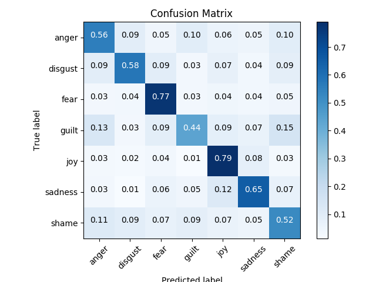

### Project: Classify Emotions in Twitter messages

### Highlights:
  - This is a **multi-class text classification** problem.
  - The goal of this project is to **classify ISEAR Emotion Dataset into 7 classes on mobile phones**.
  - This model was built with **CNN, Logistic Regression (LR) with the Bag-of-Words (BoW), TF-IDF and Word Embeddings (WE)** using **TensorFlow and TensorFlow Lite**.
  - The top performing CNN was tested on LG Nexus 5 with Android 6.0.1.
  - The script for Android test application is available in this repository

### Results:

  - Table of model accuracies:

    Model                       | Accuracy
    ----------------------------|----------
    LR with BoW                 | 14.3%
    LR with TF-IDF              | 16.5%
    CNN with WE train on Movies | 49.1%
    CNN with Random Weights     | 51.69%
    CNN with GloVe              | 60.25%
    CNN with Word2Vec           | 62.62%

  
  - Average Inference Delay on Android - 7.86ms

### Confusion Matrix:

### Data: ISEAR Emotion Dataset  (http://www.affective-sciences.org/home/research/materials-and-online-research/research-material)
  - Input: **Emotion rich tweets**
  - Output: **Emotions**
  - Examples:

    Emotion | Tweet
    --------|------------------------------------------------------------------------------------------------------
    joy     | On days when I feel close to my partner and other friends. When I feel at peace with myself and also  experience a close contact with people whom I regard greatly.
    fear    | Every time I imagine that someone I love or I could contact a serious illness, even death.
    sadness | When I think about the short time that we live and relate it to the periods of my life when I think   that I did not use this short time.
    disgust | At a gathering I found myself involuntarily sitting next to two people who expressed opinions that   I considered very low and discriminating.
    shame   | When I realized that I was directing the feelings of discontent with myself at my partner and this   way was trying to put the blame on him instead of sorting out my own feeliings.
    guilt   | I feel guilty when when I realize that I consider material things more important than caring for   my relatives. I feel very self-centered.

### Parameters:

# Model Hyperparameters
  - dropout_keep_prob: Dropout keep probability (default: 0.5)
  - embedding_dim: Size of word embeddings (default: 300)
  - filter_sizes: Comma-separated filter sizes (default: '3,4,5')
  - num_filters: Number of filters per filter size (default: 128)
  - l2_reg_lambda: L2 regularization lambda (default: 0.2)
  - max_pool_size: Size of pooling window (default: 3)

 # Training parameters
  - batch_size: Batch Size (default: 128)
  - num_epochs: Number of training epochs (default: 10)
  - evaluate_every: Evaluate model on dev set after this many steps (default: 100)
  - checkpoint_every: Save model after this many steps (default: 100)
  - num_checkpoints: Number of checkpoints to store (default: 5)

### Requirements:
  ##Google Pre-trained News Word2Vec
  - Source: https://code.google.com/archive/p/word2vec/
  - Download: https://drive.google.com/file/d/0B7XkCwpI5KDYNlNUTTlSS21pQmM/edit

##Stanford IMDB Movie Reviews
- Source: http://ai.stanford.edu/~amaas/papers/wvSent_acl2011.pdf
- Download: http://ai.stanford.edu/~amaas/data/sentiment/

  ##Stanford Pre-trained GloVe Twitter 27B
  - Source: https://nlp.stanford.edu/projects/glove/
  - Download: http://nlp.stanford.edu/data/glove.twitter.27B.zip

### Train:
  - Command: python train.py
  
### Reference:
 - [Implement a cnn for text classification in tensorflow](http://www.wildml.com/2015/12/implementing-a-cnn-for-text-classification-in-tensorflow/)
# Multiclass-CNN
