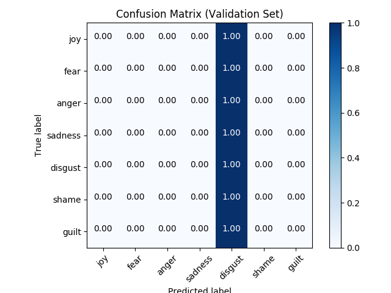

### Multi-Class Logistic Regression model

### Highlights:
  - This is a **multi-class text classification** problem.
  - The goal of this project is to **classify ISEAR Emotion Dataset into 7 classes**.
  - Here we do a one-hot-encoding of words called Bag-of-Words (BoW). We use this method and Logistic Regression (LR)
    to classify emotions in short texts
  - We also implement Text Frequency - Inverse Document Frequency (TFIDF)

### Results:

  - Table of model accuracies:

    Model              | Accuracy
    -------------------|----------
    LR with BoW        | 13.4%
    LR with TF-IDF     | N/A

### Confusion Matrix:

### Parameters:
  - batch_size:
  - dropout_keep_prob:
  - embedding_dim:
  - evaluate_every:
  - filter_sizes:
  - hidden_unit:
  - l2_reg_lambda:
  - max_pool_size:
  - non_static:
  - num_epochs:
  - num_filters:

### Requirements:

### Train:
  - Command: python bag_of_words.py

### Reference:
 - [Tensorflow Cookbook/Natural Language Processing](https://github.com/nfmcclure/tensorflow_cookbook/tree/master/07_Natural_Language_Processing)
# Multi-Class Logistic Regression
